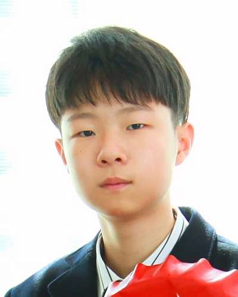

# 세명같은네명 팀 프로젝트 소개
 


## 목차
- [팀 소개](#팀-소개)
- [프로젝트 개발 이유](#프로젝트-개발-이유)
- [프로젝트 개요](#프로젝트-개요)
- [실행 방법](#실행-방법)
- [실행 영상](#실행-영상)
- [마무리 및 인사](#마무리-및-인사)

---
## 팀 소개

### 팀 이름: **세명 같은 네명**

| 이름   | 역할                   | 별명    | 사진                                                                 |
|--------|------------------------|---------|----------------------------------------------------------------------|
| <div style="text-align: center;">정창민</div> | <div style="text-align: center;">팀장 / 백엔드</div> | <div style="text-align: center;">창미니</div>  | <div style="text-align: center;"></div>                   |
| <div style="text-align: center;">한성진</div> | <div style="text-align: center;">부팀장 / 백엔드</div> | <div style="text-align: center;">진라면</div>  | <div style="text-align: center;"></div> |
| <div style="text-align: center;">김민진</div> | <div style="text-align: center;">프로그래머 / 백엔드</div> | <div style="text-align: center;">지니</div>    | <div style="text-align: center;"></div> |
| <div style="text-align: center;">권지원</div> | <div style="text-align: center;">엔지니어 / 관리 및 보조</div> | <div style="text-align: center;">잼미니</div>  | <div style="text-align: center;"></div>  |

## 프로젝트 개발 이유

팀원들과 주제를 찾던 중 뉴스로 폭행에 관련된 뉴스를 보게 되었습니다.<br>
우리 주변에도 폭행은 생각보다 쉽게 일어나고 증거를 찾기 어렵다는 사실을 알게되었습니다.<br>
실시간으로 [폭력]을 감지하고 신고 및 도움을 줄 수 있게 프로젝트를 기획하게 되었습니다.

### 주요 동기:
1. **문제 정의**: 폭력은 개인, 가족, 사회에 여러 가지 부정적인 영향을 미친다. 물리적, 심리적 피해뿐만 아니라, 폭력은 사회적 갈등을 심화시키고, 경제적 비용을 발생시키며, 장기적으로 사람들의 삶의 질을 떨어뜨린다.

2. **목표**: 목표는 폭력을 예방하고, 피해자를 보호하며, 폭력적인 행동이 사회에서 뿌리내리지 않도록 하는 것이다.

### 기술 스택:
- **백엔드**: OpenCV, MediaPipe


---

## 실행 방법

### 1. 환경 설정
1. **프로젝트**
   ```bash
   python --version
   ```
   https://www.anaconda.com/

2. **필요한 패키지 설치**
   ```bash
   pip install opencv-python
   
   pip install mediapipe
   ```
### 실행 영상
https://youtu.be/q4cO5UrCYy0


https://github.com/user-attachments/assets/8a2979fb-425d-4513-854f-1ddeee5d4ca0


---
## 프로젝트 개요

### 프로젝트 이름: **폭력이 없어지는 그날까지**

### 주요 기능(MVP):
- **기능**: 캠에서 사람의 손을 인식하여 설정 좌표값에서 얼마나 빨리 이동하는지에 따라 위협이 뜬다.

### 향후 발전:
  1. 맞고 나서 상대방에 감정반응을 인식해 무서움이나 공포, 슬픔 등의 감정을 인식하도록 만들어 장난인지 아닌지 구분.
  2. 객체 인식을 활용하여 바운딩 박스 안에 설정 거리 보다 가까워지거나 신체가 닿았을 때.
  3. 손 뿐만이 아닌 발로 때리는 것 까지 인식하도록.
  4. 손에 무기를 들고 있는지 인식.
  5. 사람 두명의 모션 인식.
  6. 맞은 후에 신체 특징을 인식하는 기능(ex: 멍,피).

### 기술 활용 가능성:
모션을 인식하는데 만약 인식한 모션이 지정 시간동안 움직임이 없다면 신고해주는 기능

## 마무리 및 인사
지금까지 저희 프로젝트를 지켜봐 주셔서 감사합니다 앞으로도 더 발전하는 세명같은 네명 팀이 되겠습니다.
